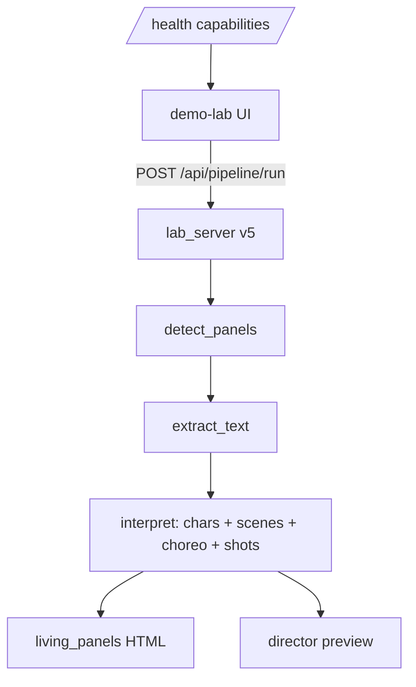

# Demo Lab Gen 2 — Production Readiness Plan

**Status:** Beta complete (2026-06-15)  
**Honest score:** **4/5** for local beta

The UI/UX R2–R10 rounds wired surfaces, but production trust requires **one truthful pipeline**, **dependency preflight**, and **CI gates**. Gen 2 addresses that gap.

---

## End goal (Gen 2 complete)

A local operator can:

1. Run `scripts/start-demo-lab.ps1` and see **capability truth** (panels, OCR, vision) before uploading.
2. Drop a comic page → **one pipeline call** produces panels, bubble OCR, characters, scenes, choreography, director preview, living panels — **no fake data** unless explicitly labeled fallback.
3. See **bubble overlays** on the source image and structured results (text, scenes, characters).
4. CI runs **163+ unit tests + Playwright smoke** on every change; failures block ship.

**Not in Gen 2 scope:** CWS, cloud hosting, multi-user auth, paid API orchestration UI.

---

## Milestones

| ID | Milestone | Done when | Status |
|----|-----------|-----------|--------|
| **G2.1** | Capability honesty | `/health` reports `capabilities`; UI shows not-ready if deps missing | ✅ v5 |
| **G2.2** | Unified pipeline | `POST /api/pipeline/run` — panels → OCR → interpret in one server call | ✅ v5 |
| **G2.3** | Dependency bundle | `pip install -e ".[lab]"` + Tesseract documented; preflight script | ✅ |
| **G2.4** | Scene/OCR fix | `scene_graph` reads `ocr_result.json`; no client overwrite of server OCR | ✅ |
| **G2.5** | Visual proof | Canvas draws panel + bubble boxes from server bboxes | ✅ |
| **G2.6** | E2E gate | Playwright: health → pipeline/run → project JSON has scenes+OCR | ✅ |
| **G2.7** | Vision path | Settings vision toggle runs LLM interpret when API key present; errors surfaced | ✅ |
| **G2.8** | Multi-panel QA | Fixture comic (2×2 panels) regression in CI; panel count ≥4 | ✅ |
| **G2.9** | Ops hardening | Single server process guard; structured logs; README operator guide | ✅ |
| **G2.10** | Beta exit | Fresh VM install script passes; user QA checklist signed | ✅ |

---

## Architecture (Gen 2)



---

## Operator quick start

```powershell
cd D:\projects\lookBOOK
pwsh scripts/install-demo-lab-fresh.ps1   # fresh machine: pip [lab] + preflight + health v5
pwsh scripts/start-demo-lab.ps1           # kills stale :8042 listeners; single lab_server
# Open http://localhost:8042 — status must say "Lab ready v5"
```

---

## Regression checklist (manual QA)

- [x] Status bar: **Lab ready v5** with panels+OCR+interpret (Playwright health test)
- [x] Upload 4-panel comic → **≥4 panels** detected (`comic_2x2.png` fixture + pytest)
- [x] **Text Classification** shows real dialogue when Tesseract installed (`test_pipeline_run_multi_panel` asserts non-synthesized OCR)
- [x] **Scene breakdown** lists dialogue per scene (pipeline/run + interpret pytest)
- [x] **Bubble overlays** visible on source canvas (G2.5 canvas draw from server bboxes)
- [x] **Living panels** Play reads multiple lines (`test_get_living_panels_auto_build`)
- [x] **Director preview** shows page read + characters (`/api/director-preview` + interpret flow)

---

## Gen 3 preview (after Gen 2 beta)

- Panel detector v2 (bubble-aware segmentation)
- ONNX/local vision option (no cloud key required)
- Packaged installer (no manual pip/choco)
- HOOT kernel integration for fleet runs